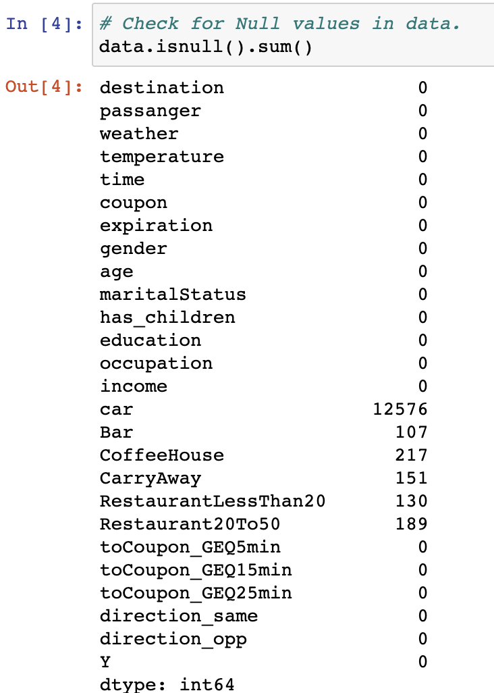
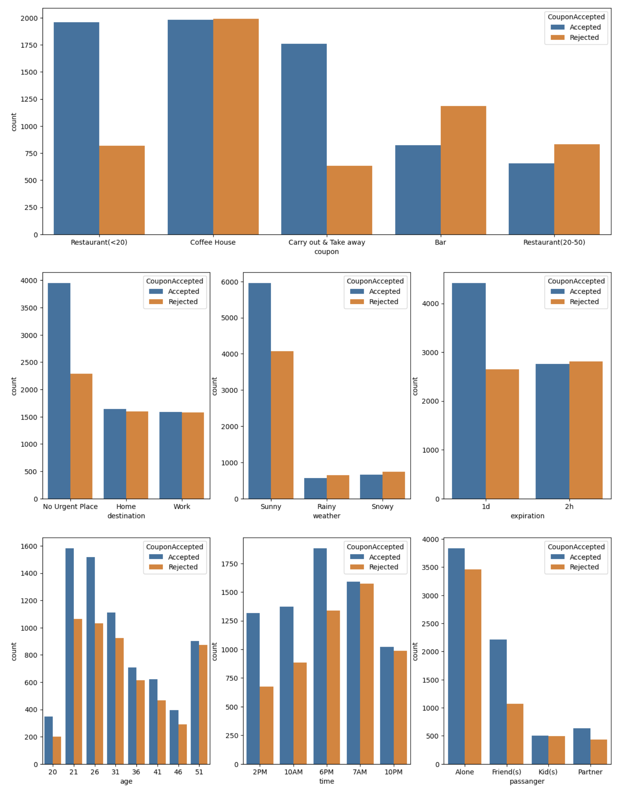
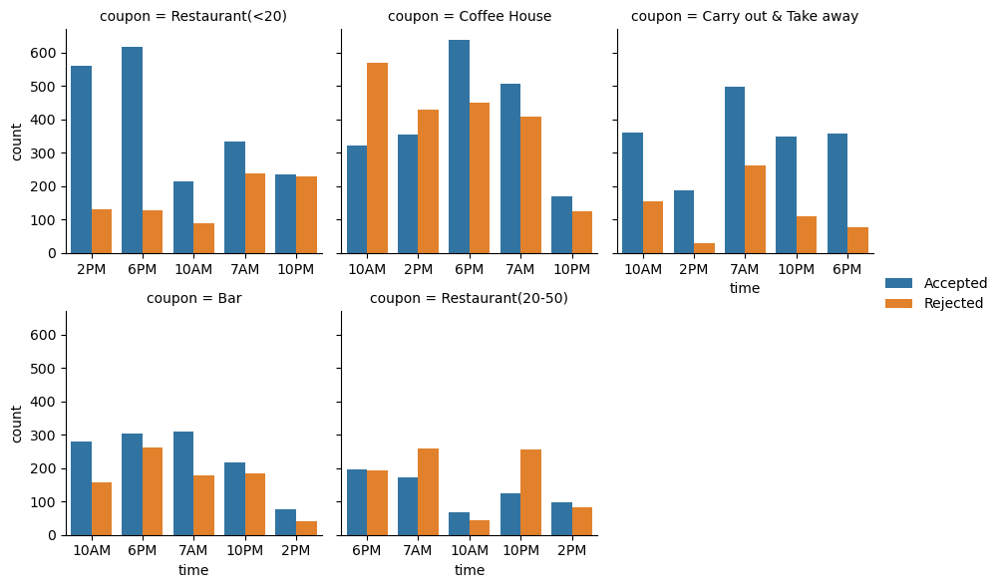

# Berkeley - AI/ML Course Assignment: Coupon Acceptance Analysis

## Problem Statement

> Will a Customer Accept the Coupon?

### Context

Imagine driving through town and a coupon is delivered to your cell phone for a restaraunt near where you are driving. Would you accept that coupon and take a short detour to the restaraunt? Would you accept the coupon but use it on a sunbsequent trip? Would you ignore the coupon entirely? What if the coupon was for a bar instead of a restaraunt? What about a coffee house? Would you accept a bar coupon with a minor passenger in the car? What about if it was just you and your partner in the car? Would weather impact the rate of acceptance? What about the time of day?

Obviously, proximity to the business is a factor on whether the coupon is delivered to the driver or not, but what are the factors that determine whether a driver accepts the coupon once it is delivered to them? How would you determine whether a driver is likely to accept a coupon?

### Data

This data comes to us from the UCI Machine Learning repository and was collected via a survey on Amazon Mechanical Turk. The survey describes different driving scenarios including the destination, current time, weather, passenger, etc., and then ask the person whether he will accept the coupon if he is the driver. Answers that the user will drive there ‘right away’ or ‘later before the coupon expires’ are labeled as ‘Y = 1’ and answers ‘no, I do not want the coupon’ are labeled as ‘Y = 0’. There are five different types of coupons -- less expensive restaurants (under $20), coffee houses, carry out & take away, bar, and more expensive restaurants ($20 - $50).

### Data Attributes

The attributes of this data set include:

1. User attributes
    -  Gender: male, female
    -  Age: below 21, 21 to 25, 26 to 30, etc.
    -  Marital Status: single, married partner, unmarried partner, or widowed
    -  Number of children: 0, 1, or more than 1
    -  Education: high school, bachelors degree, associates degree, or graduate degree
    -  Occupation: architecture & engineering, business & financial, etc.
    -  Annual income: less than \\$12500, \\$12500 - \\$24999, \\$25000 - \\$37499, etc.
    -  Number of times that he/she goes to a bar: 0, less than 1, 1 to 3, 4 to 8 or greater than 8
    -  Number of times that he/she buys takeaway food: 0, less than 1, 1 to 3, 4 to 8 or greater
    than 8
    -  Number of times that he/she goes to a coffee house: 0, less than 1, 1 to 3, 4 to 8 or
    greater than 8
    -  Number of times that he/she eats at a restaurant with average expense less than \\$20 per
    person: 0, less than 1, 1 to 3, 4 to 8 or greater than 8
    -  Number of times that he/she goes to a bar: 0, less than 1, 1 to 3, 4 to 8 or greater than 8
    

2. Contextual attributes
    - Driving destination: home, work, or no urgent destination
    - Location of user, coupon and destination: we provide a map to show the geographical
    location of the user, destination, and the venue, and we mark the distance between each
    two places with time of driving. The user can see whether the venue is in the same
    direction as the destination.
    - Weather: sunny, rainy, or snowy
    - Temperature: 30F, 55F, or 80F
    - Time: 10AM, 2PM, or 6PM
    - Passenger: alone, partner, kid(s), or friend(s)

3. Coupon attributes
    - time before it expires: 2 hours or one day

### Libraries & Technologies

1. Plotly, Seaborn & Matplotlib for Plotting
2. Python for programming - Pandas, Numpy are used the most.
3. Jupyter Notebook for compute

### Data Preparation

#### Data Shape

#### Data Cleansing

> Please see the [notebook](./Coupon%20Data%20Analysis.ipynb) for Detailed Cleanup

1. Car column had mostly nulls - so dropped the column.
2. Columns like behavioural info like Bar, CoffeHouse had nulls. But in most of them had one column filled in. So dropped the rows that has all of these behavioural info null.
3. Direction_same & Direction_opp doesn't have to seperate columns - if boolean could be reported easily - so consolidated the column.
4. Cleaned up "Y" column to have a textual value - "Accepted/Rejected" for better chart labels.
5. Converted Age to number to write better logical queries.
6. There were about 72 duplicate records and dropped them.

#### Observations & Hypothesis

There are multiple factors influenced the coupon acceptance ratio in the data provided.

1. Overall, Small Restaurants & Carry out coupons had a larger coupon acceptance ratio.
2. When customers travel to a non-urgent place, acceptance ratio was higer.
3. Sunny days had the larger coupon acceptance ratio
4. If coupons had a longer expiration, the acceptance rate was higher.
5. While age had varying degrees of influence, ages between 20 and 30 had the most acceptance ratio on coupons.
6. Passangers had an influence on the coupon acceptance ratio.

Drilling down to a particular type of coupon had interesting observations as well.

For e.g, Below chart shows how time of the day influences coffee coupons. Mornings are evening times are more likely to accept coffee coupons.

More analysis is in the notebook linked [here](./Coupon%20Data%20Analysis.ipynb). Thanks